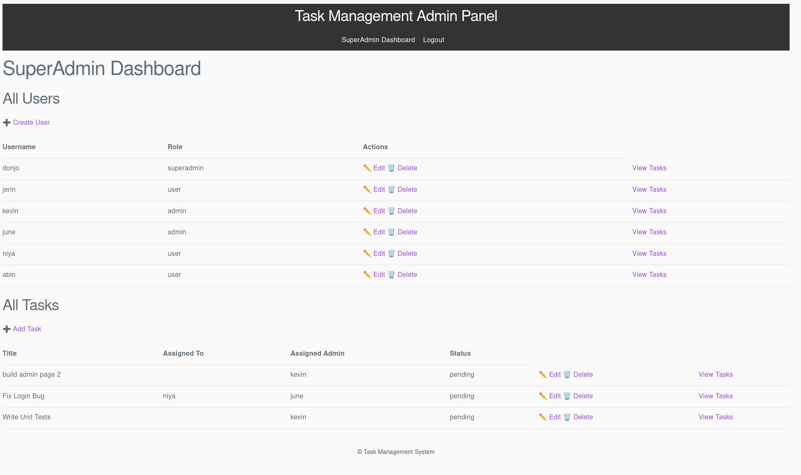

# Task Management Application

A **Task Management Application** built with **Django** and **SQLite** that allows **SuperAdmins, Admins, and Users** to manage tasks efficiently. Users can submit **completion reports and worked hours**, while Admins and SuperAdmins can monitor and manage tasks via a web admin panel.

---

## **Features**

### **User Side (API)**

* JWT authentication for secure login.
* View all tasks assigned to the logged-in user.
* Mark tasks as **Completed** with **Completion Report** and **Worked Hours**.
* Users can only interact with their own tasks.

### **Admin Panel**

#### **SuperAdmin Features**

* Create, update, delete, and assign roles to Admins and Users.
* View all tasks across all users.
* View task completion reports and worked hours.
* Assign users to Admins.
* Admin Task CRUD operations: Create, Update, Delete tasks across all users.

## SuperAdmin Dashboard



#### **Admin Features**

* Create, assign, view, and manage tasks for assigned users.
* View completion reports and worked hours for tasks assigned to users.
* Cannot manage user roles.
* Task CRUD operations limited to their assigned scope.

---

## **Models**

### **Task**

* **title**: Task name
* **description**: Task details
* **assigned_to**: User assigned to the task
* **assigned_admin**: Admin responsible for the task
* **due_date**: Task deadline
* **status**: Pending / In Progress / Completed
* **completion_report**: Text field for user report
* **worked_hours**: Numeric field for hours worked
* **created_at** / **updated_at**: Timestamps

### **CustomUser**

* Extended Django user with **role field** (`superadmin`, `admin`, `user`)
* **admin**: Reference to assigned Admin for users

---

## **Installation**

1. **Clone the repository**

```bash
git clone https://github.com/donjoo/taskify.git
cd task_project
```

2. **Create a virtual environment**

```bash
python3 -m venv env
source env/bin/activate   # Linux / macOS
env\Scripts\activate      # Windows
```

3. **Install dependencies**

```bash
pip install -r requirements.txt
```

4. **Apply migrations**

```bash
python manage.py makemigrations
python manage.py migrate
```

5. **Create a superuser**

```bash
python manage.py createsuperuser
```

  ##current db.sqlite3 SuperAdmin login info:
  
```bash
            username : donjo 
            password : Don@1234
```

6. **Run the development server**

```bash
python manage.py runserver
```

---

## **API Endpoints**

| Endpoint                  | Method | Description                                                                     |
| ------------------------- | ------ | ------------------------------------------------------------------------------- |
| `/api/accounts/login/`    | POST   | User login, returns JWT token                                                   |
| `/api/tasks/`             | GET    | List all tasks assigned to logged-in user                                       |
| `/api/tasks/<id>/`        | PUT    | Update task status (must include completion report & worked hours if completed) |
| `/api/tasks/<id>/report/` | GET    | Admin/SuperAdmin view of task report (only for completed tasks)                 |

---

## **Admin Panel URLs**

| URL                                     | Role             | Description                           |
| --------------------------------------- | ---------------- | ------------------------------------- |
| `/panel/login/`                         | All              | Login page for Admin / SuperAdmin     |
| `/panel/logout/`                        | All              | Logout                                |
| `/panel/superadmin/dashboard/`          | SuperAdmin       | SuperAdmin dashboard                  |
| `/panel/admin/dashboard/`               | Admin            | Admin dashboard                       |
| `/panel/users/create/`                  | SuperAdmin       | Create a new user                     |
| `/panel/users/<int:pk>/update/`         | SuperAdmin       | Update user details                   |
| `/panel/users/<int:pk>/delete/`         | SuperAdmin       | Delete user                           |
| `/panel/tasks/create/`                  | Admin/SuperAdmin | Create task                           |
| `/panel/tasks/<int:pk>/update/`         | Admin/SuperAdmin | Update task                           |
| `/panel/tasks/<int:pk>/delete/`         | Admin/SuperAdmin | Delete task                           |
| `/panel/admin/tasks/create/`            | Admin            | Admin creates task for assigned users |
| `/panel/superadmin/user/<int:user_id>/` | SuperAdmin       | SuperAdmin view for a particular user |
| `/panel/superadmin/task/<int:task_id>/` | SuperAdmin       | SuperAdmin view for a particular task |
| `/panel/admin/user/<int:user_id>/`      | Admin            | Admin view for a particular user      |
| `/panel/admin/task/<int:task_id>/`      | Admin            | Admin view for a particular task      |

---

## **Testing**

The project includes **unit tests** for models, views, and APIs.

Run tests with:

```bash
python manage.py test
```

Test files are organized as:

```
tasks/tests/
├─ test_models.py
├─ test_admin_views.py
├─ test_api_views.py
```

---

## **Technologies Used**

* Python 3.13
* Django 5.x
* Django REST Framework
* SQLite
* JWT Authentication
* HTML / CSS for Admin panel templates

---

## **Folder Structure**

```
task_project/
├─ accounts/
├─ tasks/
│  ├─ models.py
│  ├─ views.py
│  ├─ serializers.py
│  ├─ forms.py
│  ├─ tests/
├─ admin_panel/
│  ├─ templates/
│  │  ├─ admin_panel/
├─ task_project/
│  ├─ settings.py
│  ├─ urls.py
```

---

## **Usage**

1. Login as **SuperAdmin** to create Admins and assign users.
2. Login as **Admin** to assign tasks to users.
3. Users can update their task status and submit reports.
4. SuperAdmin and Admins can review task reports.

---

## **Notes**

* Users must provide **Completion Report** and **Worked Hours** when marking a task as completed.
* Admins cannot modify user roles.
* Pagination is implemented on dashboards for tasks.
